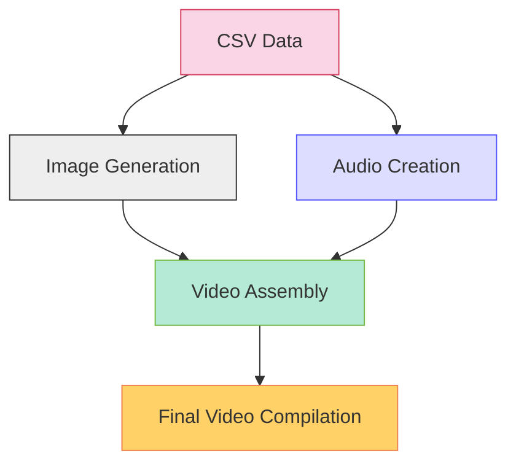

# 🎬 CSV to Video Generator 📊

<div align="center">
  
  
  
  
</div>

## 📋 Overview

This package provides powerful functionality to generate educational videos automatically from CSV data. It includes tools to create:

- 🖼️ **Images**: Custom-sized frames with text from your CSV data
- 🔊 **Audio**: Text-to-speech narration in multiple languages
- 🎥 **Videos**: Combined image and audio clips
- 🎞️ **Final Compilation**: Concatenated video sequence

## ⚙️ How It Works



## 📦 Installation

To install the package, use the following command:

```bash
pip install csv-to-video-generator
```

<blockquote>
  <p>💡 <strong>Requirements:</strong> Python 3.10+, pandas, Pillow, moviepy, and gTTS</p>
</blockquote>

## 🛠️ Dependencies

| Package | Version | Purpose |
|---------|---------|---------|
| 🐼 pandas | ^1.3.3 | Data manipulation and CSV handling |
| 🖌️ Pillow | ^8.3.2 | Image creation and text rendering |
| 🎞️ moviepy | ^1.0.3 | Video editing and compilation |
| 🔊 gTTS | ^2.2.3 | Google Text-to-Speech conversion |

## 📋 Features

- ✨ **Customizable Appearance**: Control image dimensions, colors, fonts, and text layout
- 🗣️ **Multilingual Support**: Generate audio in different languages (default: Gujarati)
- 🧩 **Modular Pipeline**: Create images, audio, and videos separately or all at once
- 🔄 **Batch Processing**: Convert multiple data entries in a single operation
- 🎯 **High Quality Output**: Professional-grade MP4 videos with H.264 encoding

## 🚀 Usage

Here's an example of how to use the `GyanDariyoVideoCreator` class to generate videos from CSV data:

```python
from csv_to_video_generator.video_creator import GyanDariyoVideoCreator

# Sample data list
data_list = [
    ["What is the primary goal of artificial intelligence?", 
     "A. Replicating human intelligence", 
     "B. Solving complex problems", 
     "C. Automating tasks", 
     "D. Enhancing decision-making processes", 
     "Answer: Replicating human intelligence", 
     ""],
    ["Which programming language is commonly used for developing AI applications?", 
     "A. Python", 
     "B. Java", 
     "C. C++", 
     "D. JavaScript", 
     "Answer: Python", 
     ""]
]

# Create an instance of the video creator
video_creator = GyanDariyoVideoCreator(data_list)

# Create images
video_creator.create_images()

# Create audio
video_creator.create_audio()

# Create videos
video_list = video_creator.create_videos()

# Create final video
final_video_path = video_creator.create_final_video(video_list)

print(f"Final video created at: {final_video_path}")
```

## 🎭 Customization Options

The `GyanDariyoVideoCreator` class accepts several parameters for customization:

| Parameter | Default | Description |
|-----------|---------|-------------|
| `image_width` | 1920 | Width of generated images in pixels |
| `image_height` | 1080 | Height of generated images in pixels |
| `background_color` | (255, 229, 244) | RGB background color |
| `font_color` | (229, 0, 135) | RGB text color |
| `font_size` | 90 | Font size in points |
| `line_spacing` | 10 | Space between lines in pixels |
| `margin` | 80 | Margin around text in pixels |
| `default_fps` | 24 | Frames per second in output video |

## 📊 Process Flow

<div align="center">
  <table>
    <tr>
      <th>Step</th>
      <th>Method</th>
      <th>Output</th>
    </tr>
    <tr>
      <td>1️⃣ Image Creation</td>
      <td><code>create_images()</code></td>
      <td>PNG files with formatted text</td>
    </tr>
    <tr>
      <td>2️⃣ Audio Generation</td>
      <td><code>create_audio()</code></td>
      <td>MP3 files with spoken text</td>
    </tr>
    <tr>
      <td>3️⃣ Video Assembly</td>
      <td><code>create_videos()</code></td>
      <td>Individual MP4 video files</td>
    </tr>
    <tr>
      <td>4️⃣ Final Compilation</td>
      <td><code>create_final_video()</code></td>
      <td>Combined MP4 video file</td>
    </tr>
  </table>
</div>

## 📁 File Output

The package generates the following files during operation:

- 🖼️ `Gyan_Dariyo_image_X.png`: Image files for each data entry
- 🔊 `Gyan_Dariyo_audio_X.mp3`: Audio files for each data entry
- 🎥 `Gyan_Dariyo_video_X.mp4`: Individual video files
- 🎞️ `Gyan_Dariyo_final_video.mp4`: Final concatenated video

## 📝 Sample Input Format

The input data should be structured as a list of lists, where each inner list represents one slide:

```
[
  ["Question text", 
   "Option A", 
   "Option B", 
   "Option C", 
   "Option D", 
   "Answer text", 
   "Additional info (optional)"],
   
  ["Next question...", 
   ...],
   
  ...
]
```

## 🧩 Advanced Usage

### CSV Import Example

```python
import pandas as pd
from csv_to_video_generator.video_creator import GyanDariyoVideoCreator

# Read data from CSV
df = pd.read_csv('questions.csv')

# Convert to required format
data_list = []
for _, row in df.iterrows():
    data_entry = [
        row['question'],
        f"A. {row['option_a']}",
        f"B. {row['option_b']}",
        f"C. {row['option_c']}",
        f"D. {row['option_d']}",
        f"Answer: {row['answer']}",
        row.get('additional_info', '')
    ]
    data_list.append(data_entry)

# Create videos
creator = GyanDariyoVideoCreator(data_list)
# ... continue with video creation steps
```

## 📜 License

This project is licensed under the MIT License.

---

<div align="center">
  <p>Developed by <a href="https://github.com/Yash-Kavaiya">Yash Kavaiya</a></p>
  <p>⭐ Star this repository if you find it useful! ⭐</p>
</div>
