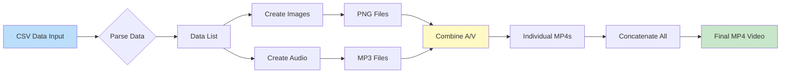

# 🎬 CSV to Video Generator 📊

<div align="center">
  
  
  
  
</div>

<div align="center">
  <h3>Transform your CSV data into engaging educational videos automatically!</h3>
  <p>A powerful Python package that converts structured data into professional video content with text-to-speech narration.</p>
</div>

---

## 📋 Table of Contents

- [Overview](#-overview)
- [Quick Start](#-quick-start)
- [Architecture](#-architecture)
- [How It Works](#️-how-it-works)
- [Installation](#-installation)
- [Dependencies](#️-dependencies)
- [Features](#-features)
- [Usage](#-usage)
- [API Reference](#-api-reference)
- [Customization Options](#-customization-options)
- [File Output](#-file-output)
- [Advanced Usage](#-advanced-usage)
- [Troubleshooting](#-troubleshooting)
- [Contributing](#-contributing)
- [FAQ](#-faq)
- [License](#-license)

## 📋 Overview

This package provides powerful functionality to generate educational videos automatically from CSV data. It includes tools to create:

- 🖼️ **Images**: Custom-sized frames with text from your CSV data
- 🔊 **Audio**: Text-to-speech narration in multiple languages
- 🎥 **Videos**: Combined image and audio clips
- 🎞️ **Final Compilation**: Concatenated video sequence

### 🎯 Perfect For:

| Use Case | Description |
|----------|-------------|
| 📚 Educational Content | Create quiz videos, flashcards, and learning materials |
| 📊 Data Presentations | Transform spreadsheet data into visual presentations |
| 🎓 E-Learning | Generate automated course content from structured data |
| 🔄 Batch Processing | Convert large datasets into video series efficiently |
| 🌐 Multilingual Content | Support for multiple languages via gTTS |

## 🚀 Quick Start

Get started in less than 5 minutes!

```bash
# Install the package
pip install csv-to-video-generator

# Create your first video
python -c "
from csv_to_video_generator.video_creator import GyanDariyoVideoCreator

data = [['Question 1?', 'A. Option 1', 'B. Option 2', 'C. Option 3', 'D. Option 4', 'Answer: Option 1', '']]
creator = GyanDariyoVideoCreator(data)
creator.create_images()
creator.create_audio()
videos = creator.create_videos()
creator.create_final_video(videos)
"
```

## 🏗️ Architecture

### Class Structure


### System Architecture


## ⚙️ How It Works

### Video Creation Pipeline


### Data Flow Diagram



## 📦 Installation

To install the package, use the following command:

```bash
pip install csv-to-video-generator
```

<blockquote>
  <p>💡 <strong>Requirements:</strong> Python 3.10+, pandas, Pillow, moviepy, and gTTS</p>
</blockquote>

## 🛠️ Dependencies

| Package | Version | Purpose | Documentation |
|---------|---------|---------|---------------|
| 🐼 pandas | ^1.3.3 | Data manipulation and CSV handling | [Docs](https://pandas.pydata.org/) |
| 🖌️ Pillow | ^8.3.2 | Image creation and text rendering | [Docs](https://pillow.readthedocs.io/) |
| 🎞️ moviepy | ^1.0.3 | Video editing and compilation | [Docs](https://zulko.github.io/moviepy/) |
| 🔊 gTTS | ^2.2.3 | Google Text-to-Speech conversion | [Docs](https://gtts.readthedocs.io/) |

### Dependency Tree


## 📋 Features

- ✨ **Customizable Appearance**: Control image dimensions, colors, fonts, and text layout
- 🗣️ **Multilingual Support**: Generate audio in different languages (default: Gujarati)
- 🧩 **Modular Pipeline**: Create images, audio, and videos separately or all at once
- 🔄 **Batch Processing**: Convert multiple data entries in a single operation
- 🎯 **High Quality Output**: Professional-grade MP4 videos with H.264 encoding

## 🚀 Usage

Here's an example of how to use the `GyanDariyoVideoCreator` class to generate videos from CSV data:

```python
from csv_to_video_generator.video_creator import GyanDariyoVideoCreator

# Sample data list
data_list = [
    ["What is the primary goal of artificial intelligence?", 
     "A. Replicating human intelligence", 
     "B. Solving complex problems", 
     "C. Automating tasks", 
     "D. Enhancing decision-making processes", 
     "Answer: Replicating human intelligence", 
     ""],
    ["Which programming language is commonly used for developing AI applications?", 
     "A. Python", 
     "B. Java", 
     "C. C++", 
     "D. JavaScript", 
     "Answer: Python", 
     ""]
]

# Create an instance of the video creator
video_creator = GyanDariyoVideoCreator(data_list)

# Create images
video_creator.create_images()

# Create audio
video_creator.create_audio()

# Create videos
video_list = video_creator.create_videos()

# Create final video
final_video_path = video_creator.create_final_video(video_list)

print(f"Final video created at: {final_video_path}")
```

## 🎨 Customization Options

The `GyanDariyoVideoCreator` class accepts several parameters for customization:

| Parameter | Type | Default | Range/Options | Description |
|-----------|------|---------|---------------|-------------|
| `data_list` | List[List[str]] | **Required** | N/A | Input data for video generation |
| `image_width` | int | 1920 | 640-3840 | Width of generated images in pixels |
| `image_height` | int | 1080 | 480-2160 | Height of generated images in pixels |
| `background_color` | tuple | (255, 229, 244) | RGB (0-255, 0-255, 0-255) | RGB background color (light pink) |
| `font_color` | tuple | (229, 0, 135) | RGB (0-255, 0-255, 0-255) | RGB text color (hot pink) |
| `font_size` | int | 90 | 12-200 | Font size in points |
| `line_spacing` | int | 10 | 0-100 | Space between lines in pixels |
| `margin` | int | 80 | 0-200 | Margin around text in pixels |
| `default_fps` | int | 24 | 10-60 | Frames per second in output video |

### Color Presets

```mermaid
graph LR
    subgraph Default Theme
        D1[Background: Light Pink]
        D2[Text: Hot Pink]
    end
    
    subgraph Professional Theme
        P1[Background: 245,245,245]
        P2[Text: 33,33,33]
    end
    
    subgraph Ocean Theme
        O1[Background: 230,244,255]
        O2[Text: 1,87,155]
    end
    
    subgraph Sunset Theme
        S1[Background: 255,235,230]
        S2[Text: 191,54,12]
    end
    
    style D1 fill:#ffe5f4
    style D2 fill:#e50087
    style P1 fill:#f5f5f5
    style P2 fill:#212121
    style O1 fill:#e6f4ff
    style O2 fill:#01579b
    style S1 fill:#ffebe6
    style S2 fill:#bf360c
```



### Video Quality Settings

| Resolution | Width x Height | Recommended FPS | File Size (per minute) | Use Case |
|------------|----------------|-----------------|------------------------|----------|
| HD Ready | 1280 x 720 | 24 | ~5-10 MB | Web streaming, mobile |
| Full HD | 1920 x 1080 | 24-30 | ~10-20 MB | Standard desktop viewing |
| 2K | 2560 x 1440 | 30 | ~20-30 MB | High-quality presentations |
| 4K | 3840 x 2160 | 30-60 | ~50-100 MB | Professional production |

## 📚 API Reference

### Class: `GyanDariyoVideoCreator`

Complete reference for all available methods:

| Method | Parameters | Returns | Description | Time Complexity |
|--------|-----------|---------|-------------|-----------------|
| `__init__()` | data_list, image_width, image_height, background_color, font_color, font_size, line_spacing, margin, default_fps | GyanDariyoVideoCreator | Initialize video creator with data and configuration | O(1) |
| `create_images()` | None | None | Generate PNG images for each data entry | O(n) where n = data entries |
| `create_audio()` | None | None | Generate MP3 audio files with text-to-speech | O(n) where n = data entries |
| `create_videos()` | None | List[str] | Create individual MP4 videos by combining images and audio | O(n) where n = data entries |
| `create_final_video()` | video_list: List[str] | str | Concatenate all videos into a single MP4 file | O(n) where n = video files |

### Method Details

#### `create_images()`

```python
def create_images(self) -> None:
    """
    Generate PNG images for each data entry.
    
    Creates image files named: Gyan_Dariyo_image_1.png, Gyan_Dariyo_image_2.png, etc.
    Each image includes all text from the corresponding data entry with proper formatting.
    
    Side Effects:
        - Writes PNG files to the current directory
        - May display images if PIL's show() is called
    
    Raises:
        IOError: If unable to write image files
        OSError: If font file is not found
    """
```

#### `create_audio()`

```python
def create_audio(self) -> None:
    """
    Generate MP3 audio files with text-to-speech narration.
    
    Creates audio files named: Gyan_Dariyo_audio_1.mp3, Gyan_Dariyo_audio_2.mp3, etc.
    Uses Google Text-to-Speech (gTTS) with Gujarati language by default.
    
    Side Effects:
        - Writes MP3 files to the current directory
        - Requires internet connection for gTTS service
    
    Raises:
        IOError: If unable to write audio files
        gTTSError: If text-to-speech conversion fails
    """
```

#### `create_videos()`

```python
def create_videos(self) -> List[str]:
    """
    Create individual MP4 videos by combining images and audio.
    
    Returns:
        List[str]: Paths to created video files
    
    Creates video files named: Gyan_Dariyo_video_1.mp4, Gyan_Dariyo_video_2.mp4, etc.
    Video duration automatically matches audio duration.
    
    Side Effects:
        - Writes MP4 files to the current directory
        - Creates audio files if not already present
    
    Raises:
        IOError: If unable to read/write video files
        ValueError: If image or audio files are missing
    """
```

#### `create_final_video()`

```python
def create_final_video(self, video_list: List[str]) -> str:
    """
    Concatenate all videos into a single MP4 file.
    
    Args:
        video_list: List of video file paths to concatenate
    
    Returns:
        str: Path to the final concatenated video file
    
    Creates final video file named: Gyan_Dariyo_final_video.mp4
    
    Side Effects:
        - Writes final MP4 file to the current directory
    
    Raises:
        IOError: If unable to read input or write output files
        ValueError: If video_list is empty
    """
```

## 📊 Process Flow

<div align="center">
  <table>
    <tr>
      <th>Step</th>
      <th>Method</th>
      <th>Output</th>
      <th>Dependencies</th>
      <th>Estimated Time*</th>
    </tr>
    <tr>
      <td>1️⃣ Image Creation</td>
      <td><code>create_images()</code></td>
      <td>PNG files with formatted text</td>
      <td>Pillow, Font files</td>
      <td>~0.5s per image</td>
    </tr>
    <tr>
      <td>2️⃣ Audio Generation</td>
      <td><code>create_audio()</code></td>
      <td>MP3 files with spoken text</td>
      <td>gTTS, Internet</td>
      <td>~2-3s per audio</td>
    </tr>
    <tr>
      <td>3️⃣ Video Assembly</td>
      <td><code>create_videos()</code></td>
      <td>Individual MP4 video files</td>
      <td>MoviePy, FFmpeg</td>
      <td>~5-10s per video</td>
    </tr>
    <tr>
      <td>4️⃣ Final Compilation</td>
      <td><code>create_final_video()</code></td>
      <td>Combined MP4 video file</td>
      <td>MoviePy, FFmpeg</td>
      <td>~10-30s total</td>
    </tr>
  </table>
  <p><em>*Estimated times for standard configurations; actual times may vary based on system resources and data complexity</em></p>
</div>

## 📁 File Output

The package generates the following files during operation:

- 🖼️ `Gyan_Dariyo_image_X.png`: Image files for each data entry
- 🔊 `Gyan_Dariyo_audio_X.mp3`: Audio files for each data entry
- 🎥 `Gyan_Dariyo_video_X.mp4`: Individual video files
- 🎞️ `Gyan_Dariyo_final_video.mp4`: Final concatenated video

## 📝 Sample Input Format

The input data should be structured as a list of lists, where each inner list represents one slide:

```
[
  ["Question text", 
   "Option A", 
   "Option B", 
   "Option C", 
   "Option D", 
   "Answer text", 
   "Additional info (optional)"],
   
  ["Next question...", 
   ...],
   
  ...
]
```

## 🧩 Advanced Usage

### CSV Import Example

```python
import pandas as pd
from csv_to_video_generator.video_creator import GyanDariyoVideoCreator

# Read data from CSV
df = pd.read_csv('questions.csv')

# Convert to required format
data_list = []
for _, row in df.iterrows():
    data_entry = [
        row['question'],
        f"A. {row['option_a']}",
        f"B. {row['option_b']}",
        f"C. {row['option_c']}",
        f"D. {row['option_d']}",
        f"Answer: {row['answer']}",
        row.get('additional_info', '')
    ]
    data_list.append(data_entry)

# Create videos
creator = GyanDariyoVideoCreator(data_list)
# ... continue with video creation steps
```

## 🔧 Troubleshooting

### Common Issues and Solutions

| Issue | Possible Cause | Solution |
|-------|---------------|----------|
| ❌ Font file not found | Missing font file `HindVadodara-SemiBold.ttf` | Ensure font file is in the working directory or provide absolute path |
| ❌ gTTS connection error | No internet connection | Check internet connectivity; gTTS requires online access |
| ❌ FFmpeg not found | MoviePy can't find FFmpeg | Install FFmpeg: `pip install imageio-ffmpeg` |
| ❌ Out of memory | Processing too many large videos | Process data in smaller batches; reduce image resolution |
| ❌ Slow video generation | Hardware limitations | Use lower FPS (15-20); reduce image dimensions |
| ⚠️ Audio out of sync | Frame rate mismatch | Ensure `default_fps` is consistent (24 recommended) |
| ⚠️ Text cut off in images | Text too long for frame | Reduce `font_size` or increase `image_width` |
| ⚠️ Poor video quality | Low resolution settings | Increase `image_width` and `image_height` to 1920x1080 or higher |

### Performance Optimization Tips


## 🤝 Contributing

We welcome contributions! Here's how you can help:

### Contribution Areas

| Area | Skill Level | Examples |
|------|-------------|----------|
| 🐛 Bug Fixes | Beginner | Fix typos, resolve issues, improve error handling |
| 📚 Documentation | Beginner | Improve README, add examples, write tutorials |
| ✨ Features | Intermediate | Add new video effects, support more formats |
| 🚀 Performance | Advanced | Optimize rendering, parallel processing |
| 🧪 Testing | Intermediate | Add unit tests, integration tests |
| 🌐 Localization | Beginner | Add language support, improve i18n |

### Development Workflow


### Getting Started with Development

1. **Fork and Clone**
   ```bash
   git clone https://github.com/YOUR_USERNAME/csv-to-video-genarator.git
   cd csv-to-video-genarator
   ```

2. **Install Dependencies**
   ```bash
   pip install -r requirements.txt
   # or using poetry
   poetry install
   ```

3. **Make Changes**
   - Create a new branch: `git checkout -b feature/your-feature-name`
   - Make your changes
   - Test thoroughly

4. **Submit Pull Request**
   - Push to your fork
   - Create a pull request with a clear description

### Code Style Guidelines

| Aspect | Standard | Tool |
|--------|----------|------|
| Code Formatting | PEP 8 | `black`, `autopep8` |
| Import Sorting | isort | `isort` |
| Type Hints | PEP 484 | `mypy` |
| Docstrings | Google Style | `pydocstyle` |
| Line Length | 100 characters | `black --line-length 100` |

## ❓ FAQ

### General Questions

<details>
<summary><strong>Q: Can I use this package for commercial projects?</strong></summary>

Yes! This package is licensed under MIT License, which allows commercial use. Please review the license terms for details.
</details>

<details>
<summary><strong>Q: What video formats are supported?</strong></summary>

The package generates MP4 videos with H.264 encoding, which is widely supported across platforms and devices.
</details>

<details>
<summary><strong>Q: Can I change the language for text-to-speech?</strong></summary>

Yes! Modify the `lang` parameter in the gTTS calls within the source code. Default is 'gu' (Gujarati). Examples: 'en' (English), 'hi' (Hindi), 'es' (Spanish).
</details>

<details>
<summary><strong>Q: How large can my CSV file be?</strong></summary>

There's no hard limit, but processing time increases linearly. For files with 1000+ rows, consider batch processing in groups of 100-200 entries.
</details>

<details>
<summary><strong>Q: Does this work offline?</strong></summary>

Partially. Image and video generation work offline, but audio generation requires internet for gTTS. Consider using an offline TTS library for offline usage.
</details>

### Technical Questions

<details>
<summary><strong>Q: Why does video generation take so long?</strong></summary>

Video encoding is CPU-intensive. Main factors:
- Image resolution (higher = slower)
- Audio duration (longer = slower)
- FPS setting (higher = slower)
- System resources

**Solution**: Start with lower resolution (1280x720) and 15 FPS for testing, then increase for final production.
</details>

<details>
<summary><strong>Q: Can I use custom fonts?</strong></summary>

Yes! Replace the font file path in the code with your .ttf font file. The current implementation uses `HindVadodara-SemiBold.ttf`.
</details>

<details>
<summary><strong>Q: How do I add subtitles or captions?</strong></summary>

This feature is not built-in but can be added. Consider using libraries like `pysrt` or `moviepy.video.tools` for subtitle generation.
</details>

### Comparison Table

| Feature | CSV-to-Video Generator | Manual Video Creation | Online Video Tools |
|---------|------------------------|----------------------|-------------------|
| 🔄 Automation | ✅ Fully automated | ❌ Manual work | ⚠️ Semi-automated |
| 💰 Cost | ✅ Free & Open Source | ⚠️ Time-intensive | ⚠️ Often paid |
| 🎨 Customization | ✅ Full control | ✅ Full control | ⚠️ Limited |
| 📊 Batch Processing | ✅ Yes | ❌ No | ⚠️ Limited |
| 🌐 Language Support | ✅ Multiple (via gTTS) | ✅ Any | ⚠️ Limited |
| 💻 Offline Use | ⚠️ Partial | ✅ Yes | ❌ No |
| 🚀 Speed | ✅ Fast for bulk | ❌ Slow | ⚠️ Moderate |

## 📁 Project Structure

```
csv-to-video-genarator/
├── 📄 README.md                    # This file
├── 📄 LICENSE                      # MIT License
├── 📄 pyproject.toml              # Poetry configuration
├── 📄 setup.py                     # Package setup
├── 📁 csv_to_video_generator/     # Main package
│   ├── 📄 __init__.py
│   └── 📄 video_creator.py        # Core video creation logic
├── 📁 Fonts/                       # Font files
│   └── 📄 HindVadodara-SemiBold.ttf
├── 📄 app.py                       # Example application
├── 📄 newvideo.py                  # Video generation script
├── 📄 answer.py                    # Answer processing
└── 📓 *.ipynb                      # Jupyter notebooks
```

## 📜 License

This project is licensed under the MIT License - see the [LICENSE](LICENSE) file for details.

### MIT License Summary

| Permission | Limitation | Condition |
|------------|------------|-----------|
| ✅ Commercial use | ❌ Liability | ℹ️ License and copyright notice |
| ✅ Modification | ❌ Warranty | ℹ️ State changes |
| ✅ Distribution | | |
| ✅ Private use | | |

---

## 🌟 Acknowledgments

Special thanks to:
- 🎨 **Pillow Team** - For excellent image processing capabilities
- 🎞️ **MoviePy Developers** - For powerful video editing tools
- 🔊 **gTTS Contributors** - For easy text-to-speech integration
- 📊 **Pandas Team** - For robust data manipulation

---

<div align="center">
  
### 👨‍💻 Developed with ❤️ by [Yash Kavaiya](https://github.com/Yash-Kavaiya)

[](https://github.com/Yash-Kavaiya)
[](https://github.com/Yash-Kavaiya/csv-to-video-genarator)

### ⭐ If you find this project useful, please consider giving it a star! ⭐

<p>
  <a href="https://github.com/Yash-Kavaiya/csv-to-video-genarator/issues">Report Bug</a>
  ·
  <a href="https://github.com/Yash-Kavaiya/csv-to-video-genarator/issues">Request Feature</a>
  ·
  <a href="https://github.com/Yash-Kavaiya/csv-to-video-genarator/pulls">Submit PR</a>
</p>

<p><em>Made with Python 🐍 | Powered by Open Source 🚀</em></p>

</div>
